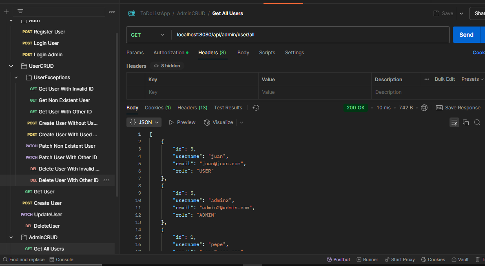

# To-Do List

## Swagger Docs
[http://localhost:8080/swagger-ui/index.html#/](http://localhost:8080/swagger-ui/index.html#/])

[http://localhost:8080/v3/api-docs](http://localhost:8080/v3/api-docs)

## Console Access
[http://localhost:8080/h2-console](http://localhost:8080/h2-console)

## Postman Collection
PATH: todolist\src\ToDoListApp.postman_collection.json

Demonstration:

---

### Features: Admin, New Endpoints added and validations.
  * The user now have more validations, and only can get, edit and delete his taks.
  * So Tasks only can be accessed by it's users and by all admins.
  * The admin can get, edit and delete all kind of users from the user endpoint.
  * Only admins can create other admins and access all task and all users.
  * A token access had been automated in postman to avoid it's manual input.

> TODO: Review validations, and typos

> TODO: Review logic on some methods

> TODO: Enhance spring open-api documentation

> TODO: Add tests for postman collection